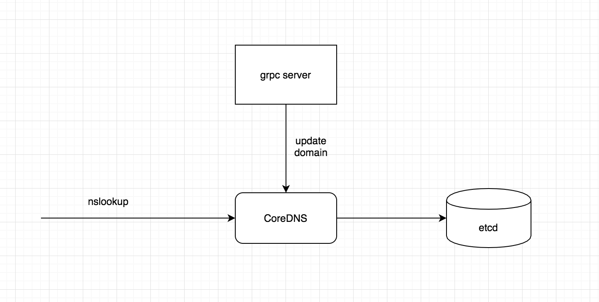

# smartdns
ddns for [holenat](http://holenat.net) base on coredns and etcd

## How does it works



## PreInstall

smartdns use coredns as dns server and etcd as backend storage, before running smartdns, you should run coredns and etcd firstly

- run etcd, [more info](https://etcd.io/)
- install [coredns](https://github.com/coredns/coredns)
- run coredns with etcd plugin [coredns etcd plugin](https://coredns.io/plugins/etcd/)


## Build & Install

```
# get source code
go get github.com/holenat/smartdns

# build proto
protoc --go_out=plugins=grpc:. smartdns.proto

# build smartdns
go build -o smartdns

```

## Run
./smartdns -c smartdns.toml

## Thanks
[coredns](https://github.com/coredns/coredns)
[etcd](https://etcd.io/)
